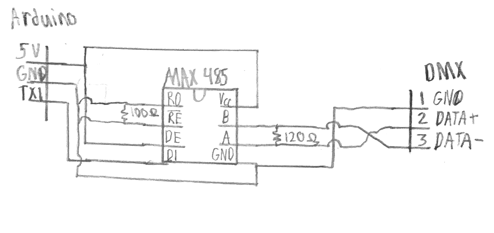

# DMX Project

by: Steven Bush

## 1. Introduction

The goal of this project was to create a DMX controller for transmitting DMX signal. I did this using an Arduino that is connected to either a PC or a Raspberry Pi. The process of getting the Arduino to send the signal took the bulk of the time while making the light change color over time did not. The goal of making this work for a Raspberry Pi failed due to me being electronically challenged. The files in this repo and in Kelli's repo work well together for making lightshows play with music.

## 2. Methods

The process of making the Arduino send the DMX signal in a way that the light would understand was not an easy task. I had started by trying to use the serial pin to send the data which would take care of the time for me. This seemed to work to make the light flash, but was not the right color. Then I tried using the 16-bit timer in the Arduino to accurately calculate 4 us. Setting up the timer took nearly 5 us, so it was useless. My last non-library attempt was to use an assembly command,`nop`, from the Atmel documents that causes nothing to happed for one cycle or 64.5 ns. This did the same as the serial method I first tried where the color was wrong and the light only pulsed.

In a last ditch attempt, I tried the DMXSerial library. This library suprisingly kept the light on by constantly sending the signal which I guess is a requirement. By testing with this code, I realized that the light channels were not 1-red, 2-green, 3-blue. They were actually 1-brightness, 2-red, 3-green, 4-blue. To get the library to use Serial1 for the output, uncomment line 33 of `DMXSerial_avr.h`. A picture of the circuitry to allow a DMX output is below. The MAX485 chip is an inverter which is needed for the inverting signal.

The last goal of the project was fairly simple to add into the original python code from project 1. I based my code off of the sample code given in Canvas, but changed it slightly for my application in how the frames are stored. Then I changed the function for sending serial data to pass the desired step time and number of channels to use to the Arduino. The channels for each DMX receiving setting for the light are:
A
1. brightness
2. red
3. green
4. blue
5. SOS
6. strobing
7. No clue the colors make no sense

d
1. brightness
2. red
3. green
4. blue

## 3. Results

Unlike project 1, the unit tests are not an indicator of this project working. To test that none of the original functionality works, the Arduino code that goes with the test script is in `test_arduino_dmx`. I have tested the code on the light for various inputs and that is the best I can do for this project. From what I have read, some libraries work with some lights while some will cause an error. The DMXSerial library seems more reliable than some of the other I tried, but there are some which do not use the serial port that may be more reliable. The non-serial libraries require additional boards, so they could not be tested by me.

## 4. Future Work

The project was mostly successful aside from failing to replace the Arduino with a Raspberry Pi. The binary file from running Kelli's `binarytodmx.py` script successfully controls the light. If I was to coninue this project, I would try to get a Raspberry Pi 400 (the keyboard one) to take place of the Arduino. From the bit of looking through the Broadcom chip documentitation, the code for the Arduino would look similar to that of the Raspberry Pi with less abstraction and different register names.

## 5. In Memoriam

This report is dedicated to both Dr. Robert's Raspberry Pi and my Raspberry Pi. I guess voltage dividers are harder to make than I thought.
